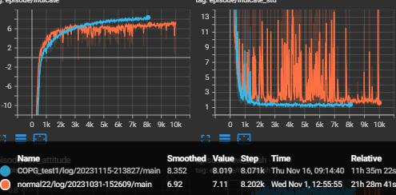

# AquaML

## Installation

```bash
conda create -n AquaML python=3.8
conda activate AquaML
conda install -c conda-forge tensorflow-gpu
pip install tensorflow-probability==0.12.2
pip install mpi4py
pip install gym
pip install keras-core
```

<!-- ### ananconda创建环境
    
```bash
    conda create -n AquaML python=3.10
    conda activate AquaML
```
### step2 安装cuda版本的tensorflow

最好参考官网的安装教程，安装对应版本的cuda和cudnn -->


## Citation

If you use AquaML in your research, please cite our repository:

```bibtex
@misc{aquaml,
  author = {Yang Tao, Yushu Yu},
  title = {{AqauML}: Distributed Deep Learning framework based on Tensorflow2},
  year = {2023},
  publisher = {GitHub},
  journal = {GitHub repository},
  howpublished = {\url{https://github.com/BIT-aerial-robotics/AquaML/tree/2.1.11}},
}
```

## Usage

### Create a self defined model

You do not need to concentrate on how the model will be used in the framework. You just need to define a model class which inherits from `Model` and implement the `call` method. Some algorithms may need to implement special functions. 


Now we give an example of a simple model. The model is used in reinforcement learning proximal policy gradient. The input of the model is image with shape (64,64,1) and a tensor with shape (6,). And we will use CNN to extract features from the image and concatenate the features with the tensor. Then we will use a LSTM layer to extract the temporal features. Finally, we will use a dense layer to output the action.

The input of `call` must contain `mask=None` even though you do not use it. 

```python
import tensorflow as tf

class Actor_net(tf.keras.Model):
    def __init__(self, ):
        super(Actor_net, self).__init__()

        self.encoder = tf.keras.Sequential(
            [
                tf.keras.layers.Conv2D(
                    filters=8,
                    kernel_size=7,
                    input_shape=(64, 64, 1),
                    activation='relu',
                ),
                tf.keras.layers.MaxPooling2D(pool_size=(2, 2), strides=2, name='pool1'),
                tf.keras.layers.Conv2D(filters=16, kernel_size=4, activation='relu', name="conv2", ),
                tf.keras.layers.MaxPooling2D(pool_size=(2, 2), strides=2, name="pool2"),
                tf.keras.layers.Flatten(),
                tf.keras.layers.Dense(128, name="IMG_layer1"),
                tf.keras.layers.LeakyReLU(0.15),
                tf.keras.layers.Dense(64, name="IMG_layer2"),
                tf.keras.layers.LeakyReLU(0.15),
            ])

        self.lstm = tf.keras.layers.LSTM(256, return_sequences=True, return_state=True, name="LSTM_layer")

        self.dense = tf.keras.layers.Dense(128, name="dense_layer")

        self.leaky_relu1 = tf.keras.layers.LeakyReLU(0.2)

        self.dense2 = tf.keras.layers.Dense(64, name="dense_layer2")

        self.leaky_relu2 = tf.keras.layers.LeakyReLU(0.2)

        self.action_layer = tf.keras.layers.Dense(4, name="action_layer")

        # config input and output
        self.output_info = {'action': (4,), 'hidden1': (256,), 'hidden2': (256,)}
        self.input_name = ('img', 'actor_obs', 'hidden1', 'hidden2')

        # config optimizer
        self.optimizer_info = {
            'type': 'Adam',
            'args': {'learning_rate': 3e-4,
                     'epsilon': 1e-5,
                     'clipnorm': 0.5,
                     },
        }

        # config special flag, it is used for special network, such as rnn
        self.rnn_flag = True

    def call(self, img, actor_obs, hidden1, hidden2, mask=None):
        
        # conv usully can not support sequence input, so we need to reshape the input
        img = tf.reshape(img, (-1, width, height, channel)) 
        encode = self.encoder(img)

        # When use rnn, if encode can't output as (batch_size, time_step, 64), use this reshape
        encode = tf.reshape(encode, (actor_obs.shape[0], actor_obs.shape[1], 64))

        x = tf.concat([encode, actor_obs], axis=-1)

        x, hidden1, hidden2 = self.lstm(x, initial_state=[hidden1, hidden2], mask=mask)

        x = self.dense(x)
        x = self.leaky_relu1(x)
        x = self.dense2(x)
        x = self.leaky_relu2(x)
        action = self.action_layer(x)

        return action, hidden1, hidden2
```

In all algorithms, you need to specify the output and input of the model. The output and input are specified by `output_info` and `input_name`. The `output_info` is a dictionary, the key is the name of the output, and the value is the shape of the output. The `input_name` is a tuple, the elements of the tuple are the name of the input. The order of the elements in the tuple is the same as the order of the input in the `call` method.


### Parrallel training

If you want to train your model in parallel, you just need to add the following code to your code.

```python
from mpi4py import MPI
from AquaML.Tool import allocate_gpu
comm = MPI.COMM_WORLD  # get group communicator
allocate_gpu(comm,1) # use GPU 1
rank = comm.Get_rank()
```

Then add `comm` to the algorithm runner initialization. 

At last, you can run your code with mpi. For example, if you want to use 4 cpus to train your model, you can run the following command.

```bash
mpirun -np 4 python your_code.py
```

**Note**: parallel training will be changed in the future.

### Monitor training process

The log will be saved in `project/log` folder. Use the following command to monitor the training process.

```bash
tensorboard --logdir .
``` 

## Reinforcement Learning

Our framework provides some reinforcement learning algorithms and supports parallel training. 

We have implemented the following algorithms:

- [1] Proximal Policy Optimization (support LSTM)
- [2] Adeversarial motion priors
- [3] Twin Delayed Deep Deterministic Policy Gradient
- [4] Soft Actor Critic (Testing)
- [5] Clipped-Objective Policy Gradient(support LSTM)

We also implement offline reinforcement learning algorithms:

- [1] Twin Delayed Deep Deterministic Policy Gradient & Behavior Cloning

We provide two rollout methods: `run()` and `run_off_policy()`. `run()` collect data by trajectory. `run_off_policy()` collect data by step. `run()` methods can use trajectory filter tools.


Now we give an example of how to create self defined environment.

Features of our framework:

1. Heterogeneous actor critic. The input of actor and critic can be different.

2. Multimodal input. Different data types can be trained directly.

3. EnvPool is implemented by pure python. It is easy to use and modify.

4. Faster and more stable than stable-baselines3.

5. The model can be used by all algorithms. For example, a model trained with TD3 can then be trained with PPO.


We support `gym` environment. But we also need you to wrap the environment. Here we give an example of how to wrap the `gym` environment.

```python
import gym
from AquaML.DataType import DataInfo
from AquaML.core.RLToolKit import RLBaseEnv

class PendulumWrapper(RLBaseEnv):
    def __init__(self, env_name="Pendulum-v1"):
        super().__init__()
       

        self.step_s = 0
        self.env = gym.make(env_name)
        self.env_name = env_name

        # our frame work support POMDP env
        self._obs_info = DataInfo(
            names=('obs', 'step',),
            shapes=((3,), (1,)),
            dtypes=np.float32
        )

        self._reward_info = ['total_reward', ]

    def reset(self):
        observation = self.env.reset()
        observation = observation[0].reshape(1, -1)

        self.step_s = 0
  

        obs = {'obs': observation, 'step': self.step_s}

        obs = self.initial_obs(obs) # this function is used to initialize the obs(must be called)

        return obs, True  # 2.0.1 new version

    def step(self, action_dict):
        self.step_s += 1
        action = action_dict['action']
        if isinstance(action, tf.Tensor):
            action = action.numpy()
        # action *= 2
        observation, reward, done, tru, info = self.env.step(action)
        observation = observation.reshape(1, -1)

        obs = {'obs': observation, 'step': self.step_s}

        obs = self.check_obs(obs, action_dict) # this function is used to check the obs(must be called)

        reward = {'total_reward': reward}

        return obs, reward, done, info

    def close(self):
        self.env.close()

```

Our framework supports two types of parallel training-- parallel model and parallel environment(vectorized enviroment).

default parallel is parallel model.

If you want to use Vectorized environment, you need to add the following code to your code.

**Note**: Currently, we only support A2C parallel training. We will support A3C parallel training in the future.

```python
from AquaML.core.RLToolKit import RLVectorEnv

vec_env = RLVectorEnv(PendulumWrapper, 20, normalize_obs=False, )
# create 20 environments in single process
```

This code will create 20 environments in a single process. The first parameter is the environment class, the second parameter is the number of environments.  


### Adversarial motion priors

AMP is usally used to simplify the rewad function if you have expert data. This will be very useful in complex tasks.

We provide an example of how to use AMP. Also see Tutorial2\AMPBugDetect.py.


Define discriminator network:

```python

import tensorflow as tf

class Discriminator_net(tf.keras.Model):
    def __init__(self):
        super(Discriminator_net, self).__init__()

        self.dense1 = tf.keras.layers.Dense(128, activation='relu',
                                            kernel_initializer=tf.keras.initializers.orthogonal())
        self.dense2 = tf.keras.layers.Dense(128, activation='relu',
                                            kernel_initializer=tf.keras.initializers.orthogonal())
        self.dense3 = tf.keras.layers.Dense(1, activation=None, kernel_initializer=tf.keras.initializers.orthogonal())

        self.output_info = {'value': (1,)}

        self.input_name = ('obs', 'next_obs',)

        self.optimizer_info = {
            'type': 'Adam',
            'args': {'learning_rate': 3e-4,
                     'epsilon': 1e-5,
                     'clipnorm': 0.5,
                     }
        }

    @tf.function
    def call(self, obs, next_obs):
        input = tf.concat([obs, next_obs], axis=-1)
        x = self.dense1(input)
        x = self.dense2(x)
        value = self.dense3(x)

        return value

    def reset(self):
        pass

```

Note: AMP agent will load expert data according to `self.input_name = ('obs', 'next_obs',)`


Provide AMP parameters:

```python
from AquaML.rlalgo.AgentParameters import AMPAgentParameter

parameters = AMPAgentParameter(
    rollout_steps=200,
    epochs=500,
    batch_size=256,

    # AMP parameters
    k_batch_size=256,
    update_discriminator_times=15,
    discriminator_replay_buffer_size=int(1e5),
    gp_coef=10.0,
    task_rew_coef=0.5,
    style_rew_coef=0.5,

    update_times=1,
    max_steps=200,
    update_actor_times=1,
    update_critic_times=1,
    eval_episodes=5,
    eval_interval=10000,
    eval_episode_length=200,
    entropy_coef=0.0,
    batch_advantage_normalization=False,
    checkpoint_interval=20,
    log_std_init_value=0.0,
    train_all=False,
    min_steps=200,
    target_kl=0.01,
    lamda=0.95,
    gamma=0.95,

    # config how to calculate reward
    summary_style='step',  # summary style, 'step' or 'episode'
    summary_steps=200, # if summary_style is 'step', how many steps to summary
)

```

Config AMP agent and provide expert data:

```python
agent_info_dict = {
    'actor': Actor_net,
    'critic': Critic_net,
    'agent_params': parameters,
    'discriminator': Discriminator_net,
    'expert_dataset_path': 'ExpertPendulum', # expert data path
}    
```

At this situation, we will load expert data from `ExpertPendulum` folder. The expert data should be saved as `obs.npy` and `next_obs.npy`. The shape of `obs.npy` and `next_obs.npy` should be (N, obs_dim) and (N, obs_dim) respectively.

At lats, create AquaRL.

```python
from AquaML.rlalgo.AqauRL import AquaRL
from AquaML.rlalgo.AqauRL import AquaRL, LoadFlag

rl = AquaRL(
    env=vec_env,
    agent=AMPAgent,
    agent_info_dict=agent_info_dict,

    name='pendulum',
    reward_norm=False,
    state_norm=False,
    decay_lr=False,

)

rl.run()
```

### Twin Delayed Deep Deterministic Policy Gradient

We give an example of how to use TD3. Also see Tutorial2\TD3BipedalWalker.py.

Step 1: Define actor network and critic network. 
Step 2: Wrap the environment.

```python
class BipedalWalker(RLBaseEnv):
    def __init__(self, env_name="BipedalWalker-v3"):
        super().__init__()
        # TODO: update in the future
        self.step_s = 0
        self.env = gym.make(env_name, hardcore=True)
        self.env_name = env_name

        # our frame work support POMDP env
        self._obs_info = DataInfo(
            names=('obs', 'step',),
            shapes=((24,), (1,)),
            dtypes=np.float32
        )

        self._reward_info = ['total_reward', 'indicate_1']

    def reset(self):
        observation = self.env.reset()
        observation = observation[0].reshape(1, -1)

        self.step_s = 0
        # observation = observation.

        # observation = tf.convert_to_tensor(observation, dtype=tf.float32)

        obs = {'obs': observation, 'step': self.step_s}

        obs = self.initial_obs(obs)

        return obs, True  # 2.0.1 new version

    def step(self, action_dict):
        self.step_s += 1
        action = action_dict['action']
        if isinstance(action, tf.Tensor):
            action = action.numpy()
        # action *= 2
        observation, reward, done, tru, info = self.env.step(action)
        observation = observation.reshape(1, -1)

        indicate_1 = reward
        #
        if reward <= -100:
            reward = -1
            done = True

        obs = {'obs': observation, 'step': self.step_s}

        obs = self.check_obs(obs, action_dict)

        reward = {'total_reward': reward, 'indicate_1': indicate_1}

        # if self.id == 0:
        #     print('reward', reward)

        return obs, reward, done, info

    def close(self):
        self.env.close()

```

Step 3: Define TD3 parameters.

```python
parameters = TD3AgentParameters(
    epochs=100000000,
    max_steps=1000,
    rollout_steps=1,
    batch_size=256,
    update_times=1,
    eval_interval=2000,
    eval_episodes=1,
    eval_episode_length=1000,
    learning_starts=1000,
    checkpoint_interval=1000,
    explore_noise=0.25,
    policy_noise=0.2,
    delay_update=1,
)
```

Step 4: Config TD3 agent.

Step 5: Create AquaRL.

Step 6: Run.

```python
rl.run_off_policy()
```
### Twin Delayed Deep Deterministic Policy Gradient & Behavior Cloning

We give an example of how to use TD3BC. Also see Tutorial2\TD3BCBipedalWalker.py.
This tutorial can be also used for other offline RL algorithms.

As before, we need to define actor network and critic network. Then we need to wrap the environment. But offline RL do not need to interact with the environment. So we do not need to define `step` and `reset` method. We just need to define `__init__` method. But if you want to test your policy by interacting with the environment, you need to define `step` and `reset` method.

### Benchmark

#### PPO vs COPG

<!-- 插入图片 -->

<center>
       
    <br>
    <div style="color:orange; border-bottom: 1px solid #d9d9d9;
    display: inline-block;
    color: #999;ss
    padding: 2px;">PPOvsCOPG</div>
</center>


### Create your own reinforcement learning algorithm