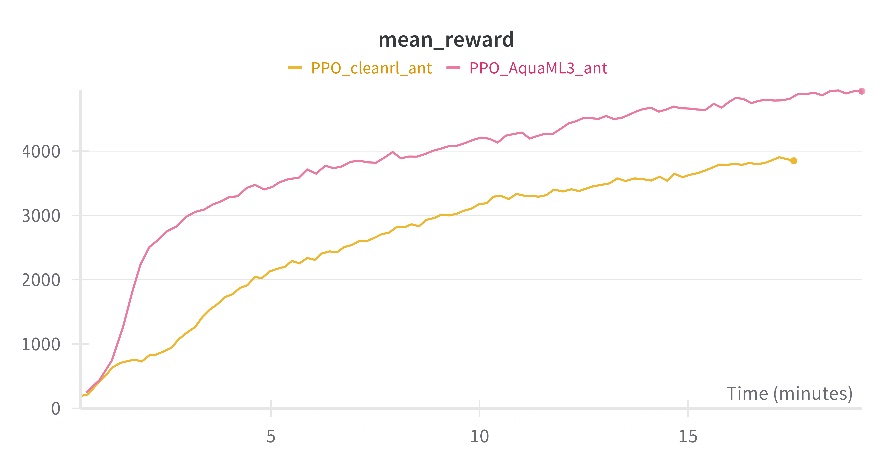
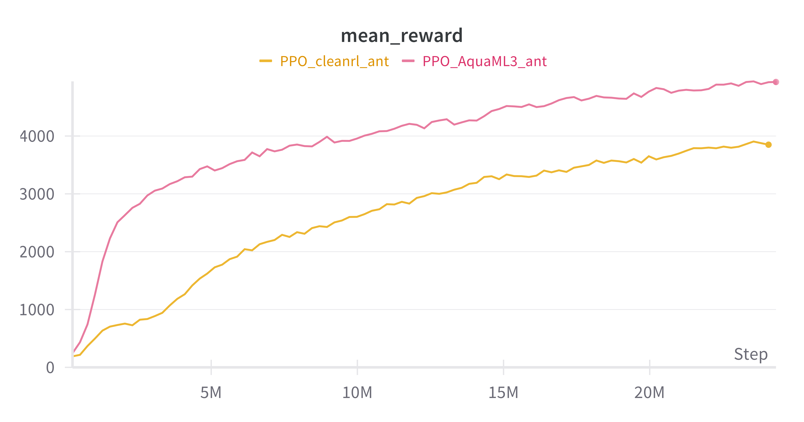
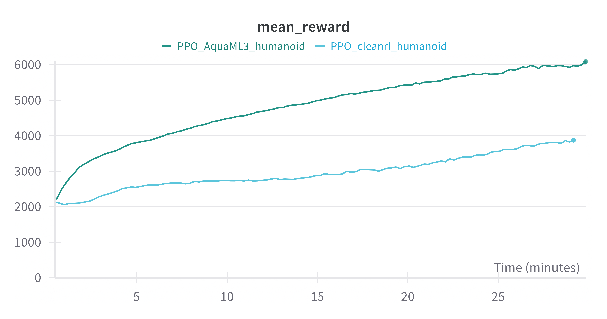
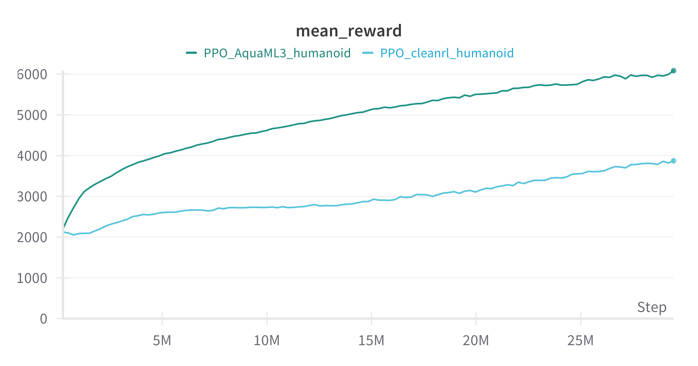

<p align="center">
  
</p>

# AquaML

## Overview

AquaML是一个分布式深度学习框架，该框架像水一样灵活，主要为**机器人学习任务**而设计的，能够实现多种深度学习任务。并且结构简单，方便修改。AquaML还能够支持多种主流深度学习框架，如tensorflow、torch等。未来将支持jax等框架。

AquaML V3版本在整体上对V2版本进行了重构，我们希望未来的智能体是能够持续进化持续学习。仿真和现实中的差距很难进行缩小，针对任务构建仿真器工作量巨大。我们希望智能体能够在仿真里面学习一些基础技能，利用此套架构再现实中持续进化。

AquaML3目前能够支持torch、tensorflow，未来将尝试支持更多的深度学习框架。
同时支持Linux、Windows、MacOS。
此外AquaML3具有良好的兼容性，能够在python3.7-3.11的环境下运行，但是完整版本需要python3.8以上。
AquaML3支持了Isaac gym。


## Installation

### 必须安装的软件

pynvml, loguru，wandb，mpi4py

mpi4py推荐使用conda安装，
```bash
conda install -c conda-forge mpi4py
```

其余的库可以使用pip安装。

### 可选安装软件

#### gymnasium或gym

推荐使用gymnasium，安装方法如下：

```bash
pip install gymnasium[all]
conda install swig
pip install pygame
conda install -c conda-forge box2d-py
pip install gymnasium[all]
```

#### tensorflow或torch

安装方法可以参考官网。

### 常见使用案例

#### torch基础版

安装顺序如下：
torch, gymnasium, pynvml, loguru, wandb, mpi4py

#### Issac gym

按照Isaac gym官网安装完以后，额外安装pynvml, loguru, wandb, mpi4py。

## Introduction
 
### Features

1. AquaML2具有的特性AquaML3都有，但是AquaML3更加强调多进程的支持。
2. 支持全异构架构，所以进程可以用自己的频率运行，不受其他进程影响。
3. 集成机器人套件，深度支持ROS。

## Quick Start

### 强化学习

详细教程看examples文件夹。
Tool\xxxMaker.py用于兼容不同的运行环境，请如系统使用的是Isaac gym，请使用IsaacGymMaker.py。


## Benchmarks


## Isaac gym
在本项测试中，计算机配置为GTX 1050Ti，i5-7300HQ，32GB内存，python 3.7

所有测试所使用的参数如下：
| 参数 | 值 |
| --- | --- |
| num_envs | 256 |
| rollout_steps | 64 |
| batch_size | 8192 |
|PPO epochs| 4 |
|clip_ratio| 0.2|
|entropy_coef| 0.0|

网络结构均为两层全连接层，每层256个神经元，激活函数为ReLU。
### Ant

<table>
  <tr>
    <td></td>
    <td></td>
  </tr>
</table>

### Humanoid

<table>
  <tr>
    <td></td>
    <td></td>
  </tr>
</table>

<!-- <div style="display: flex;">
  
  
</div> -->