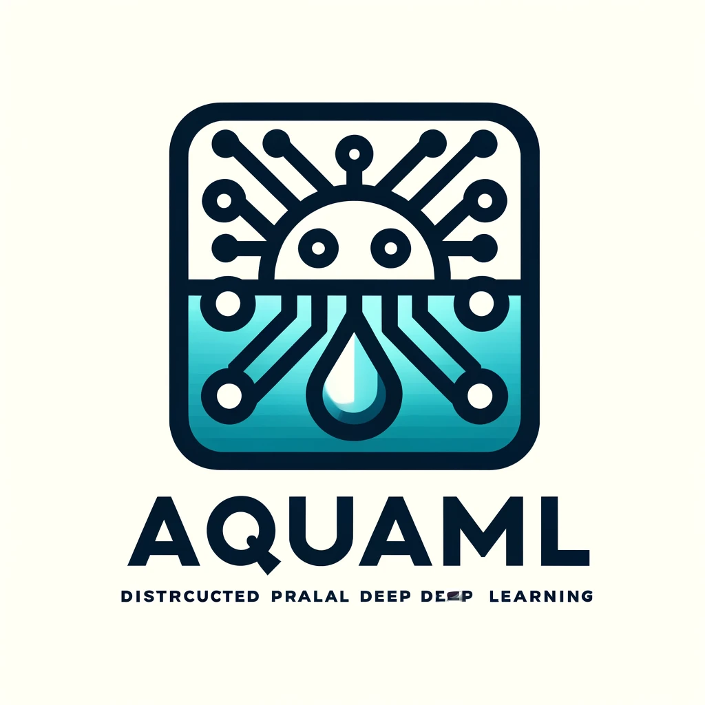

# AquaML 

## Overview

AquaML V3版本在整体上对V2版本进行了重构，我们希望未来的智能体是能够持续进化持续学习。仿真和现实中的差距很难进行缩小，针对任务构建仿真器工作量巨大。我们希望智能体能够在仿真里面学习一些基础技能，利用此套架构再现实中持续进化。
另外我们希望能利用机载计算机集群在真机中能够实时进行大模型的推理甚至训练。

AquaML3目前能够支持torch、tensorflow，未来将尝试支持更多的深度学习框架。
此外AquaML3具有良好的兼容性，能够在python3.7-3.11的环境下运行，但是完整版本需要python3.8以上。

AquaML支持Isaac，为了能够支持更多不同的环境并行，AquaML3采用OpenMPI进行并发（正在完善），这也让AquaML3能够支持多机多卡。


## Installation
### python环境必须的库

pynvml, loguru，Gym（gymnasium），wandb，tensorflow-gpu（torch）

### 安装方法

#### 1. 创建虚拟环境

```bash
conda create -n AquaML python=3.8
conda activate AquaML
```

#### 2. 安装tensorflow-gpu(可选择torch)

```bash
conda install tensorflow-gpu=2.6 
```
Pytorch安装方法请参考官网。

#### 3. 安装gymnasium

```bash
pip install gymnasium[all]
conda install swig
pip install pygame
conda install -c conda-forge box2d-py
pip install gymnasium[all]
```


#### 4. 安装其他依赖库

```bash
pip install pynvml
pip install loguru
pip install wandb
conda install -c conda-forge mpi4py
```


## Introduction
 
### Features

1. AquaML2具有的特性AquaML3都有，但是AquaML3更加强调多进程的支持。
2. 支持全异构架构，所以进程可以用自己的频率运行，不受其他进程影响。
3. 集成机器人套件，深度支持ROS。

# Benchmarks


## Isaac gym
在本项测试中，计算机配置为GTX 1050Ti，i5-7300HQ，32GB内存，python 3.7

所有测试所使用的参数如下：
| 参数 | 值 |
| --- | --- |
| num_envs | 256 |
| rollout_steps | 64 |
| batch_size | 8192 |
|PPO epochs| 4 |
|clip_ratio| 0.2|
|entropy_coef| 0.0|

网络结构均为两层全连接层，每层256个神经元，激活函数为ReLU。
### Ant


### Humanoid


