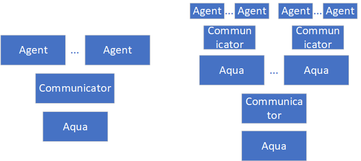
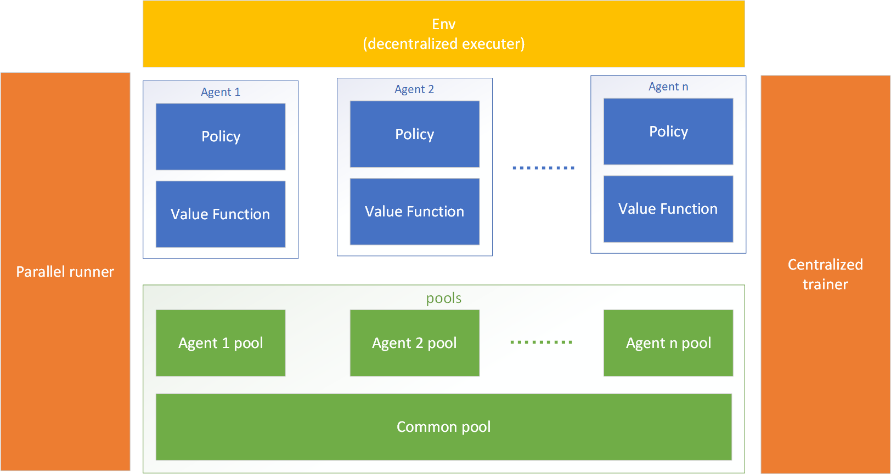

# AquaML


- [AquaML](#aquaml)
  - [安装教程](#安装教程)
  - [架构说明](#架构说明)
    - [MARL框架](#marl框架)
  - [使用教程](#使用教程)
    - [Meta Gradient Reinforcement learning](#meta-gradient-reinforcement-learning)
      - [环境创建创建指南](#环境创建创建指南)
    - [Fusion Proximal Policy Optimization](#fusion-proximal-policy-optimization)
      - [有待解决的问题（中英混合）](#有待解决的问题中英混合)
  - [Tricks](#tricks)
    - [1. 学习率衰减](#1-学习率衰减)
  - [提醒](#提醒)
  - [2.1版本更新说明](#21版本更新说明)
  - [下版本功能](#下版本功能)
  - [更新说明](#更新说明)
    - [v2.0.1](#v201)

  

## 安装教程
暂时不发布完整包，使用时候直接将AquaML文件夹放入项目中即可。


必须的依赖项：

1. tensorflow >= 2.0.0
2. tensorflow-probability
3. mpi4y
4. gym

注意：tensorflow-probability安装时需要对应tensorflow版本，例如tensorflow 2.0.0对应tensorflow-probability 0.8.0，可以参考https://github.com/tensorflow/probability/tags

在选择python版本时候，在能够满足安装tensorflow-gpu和mpi4py的情况下，尽量选择最新的python版本。

conda安装式例:
      

```python
conda create -n AquaML python=3.8
conda activate AquaML
conda install tensorflow-gpu
pip install tensorflow-probability==0.12.2
pip install mpi4py
pip install gym
```

## 架构设计过程(For developer)

不写出来在开发过程中实在太容易懵圈，也不方便后期维护，现在记录一下算法框架逐渐完善的过程。
未来所有开发基于此套框架进行不在进行新的更新。

### 给开发者建议

1. 添加新模块时候，在所有基类调用请使用如下形式：

```python
name_info = {
  type: 'Default',
  args: {},
}
```

### 主框架设计(Aqua模块)

此套框架主要目的是能够兼容所有算法，并且能够直接提供超参数调整，多线程并发功能。

我们将每一个运行实列称为Auqa，一个Aqua可以包含多个Aqua或者Agent， Agent是一个算法的实现，例如PPO，SAC，GAN。Agent为最小单元。多个Aqua嵌套时候，子Aqua必须包含一个Agent。Aqua内的的通信靠Comunicator模块。

我们给出Aqua内部的俩种形式，如下图所示：

<center>
       
    <br>
    <div style="color:orange; border-bottom: 1px solid #d9d9d9;
    display: inline-block;
    color: #999;ss
    padding: 2px;">Aqua框架图</div>

</center>

理论上Auqa内部可以像树状图一样无限嵌套，但是上图两个形式最为实用， 左图可以用于运行单个算法，如GAN，同时也可以为强化学习提供多线程采样功能（注意一个agent为一个具体算法，请不要理解成多智能体，多智能体算法再这个里面算一个agent，或者将这个agent称为learning agent,当然也支持你想象的agent，这种可以在联邦学习中使用）。右图可以用于调参。

当前设计算法时候我们要求，主线程初始化完毕才能开始进一步初始化子线程。
### Communicator模块

Communicator将负责如下的功能：多线控制(通信，同步)，共享池的维护。
Communicator负责处理Aqua内部的数据请求，但不负责对子模块数据mapping，这个部分将由具体算法决定.

Communicator一个很重要的功能就是去同步数据和相关参数，Communicator的数据池结构图：

<center>
       
    <br>
    <div style="color:orange; border-bottom: 1px solid #d9d9d9;
    display: inline-block;
    color: #999;
    padding: 2px;">Communicator框架图</div>
</center>

Comunicator创建数据字典需要两个参数：AgentIOInfo和Sync Param，具体传入形式都是通过DataInfo类传入，DataInfo类将在DataParser模块中介绍。

Comunicator的设计旨在让框架拥有更好的适应性，能够适应不同的计算机框架，单机中使用Shared Memory作为数据池，多机中使用MPI进行数据传输。未来如果可以，尝试引入Ray作为数据池。

### DataParser模块

数据解析模块，负责将数据解析成算法需要的数据格式，在不知道数据格式，使用MPI进行大规模数据传输之前，预传输数据的大小，以及数据格式，这个模块将负责这个部分。

该模块可以理解为数据协议，同时包含了Json格式的数据解析。

该模块同时将提供一些数据结构，如DataInfo， DataInfo总结了当前Agent需要的数据信息，包括数据大小，数据格式，数据类型等。

## 架构说明
### MARL框架

<center>
       
    <br>
    <div style="color:orange; border-bottom: 1px solid #d9d9d9;
    display: inline-block;
    color: #999;
    padding: 2px;">MARL框架图</div>
</center>


## 使用教程

### 如何在AquML中创建深度模型
该框架仅仅支持使用类的方式创建网络模型，actor和critic遵守同样的创建方式，例如：

```python

class Model(tf.keras.Model):

    def __init__(self):
        super(Actor_net, self).__init__()

        self.lstm = tf.keras.layers.LSTM(32, input_shape=(2,), return_sequences=False,return_state=True)
        self.dense1 = tf.keras.layers.Dense(64, activation='relu')
        self.dense2 = tf.keras.layers.Dense(64, activation='relu')
        self.action_layer = tf.keras.layers.Dense(1, activation='tanh')
        self.log_std = tf.keras.layers.Dense(1)

        self.learning_rate = 2e-4

        self.output_info = {'action': (1,), 'log_std': (1,), 'hidden1': (32,), 'hidden2': (32,)}

        self.input_name = ('pos', 'hidden1', 'hidden2')

        self.optimizer_info = {
          type: 'Adam',
          args: {
            'learning_rate': self.learning_rate,
          }
        }

        self.rnn_flag = True

    @tf.function
    def call(self, vel, hidden1, hidden2):
        hidden_states = (hidden1, hidden2)
        whole_seq, last_seq, hidden_state = self.lstm(vel, hidden_states)
        x = self.dense1(whole_seq)
        x = self.dense2(x)
        action = self.action_layer(x)
        log_std = self.log_std(x)

        return (action, log_std, last_seq, hidden_state)

    def reset(self):
        pass
```

### Meta Gradient Reinforcement learning

#### 环境创建创建指南

在使用该算法时，如果不需要reward超参数调节，正常创建即可。如果要是用meta调整reward参数，请参照以下方式。

首先需要声明元学习参数是什么，我们给出的接口是``self.meta_parameters``，注意，字典里面的key应该是env的一个属性例如：

```python
self.ratio = 1.0
self.bias = 0.0

self.meta_parameters = {
          'ratio': 1.0,
           'bias': 0.0,
        }
```

此外需要声明``get_reward``的输入信息：

```python
self.reward_fn_input = ('indicate_reward', 'ratio', 'bias')
```

在meta里面计算reward时候会自动调用``get_reward``函数。注意``get_reward``输入是是tensor中间所有运算都要用tensorflow提供的接口运算。例如:

```python
def get_reward(self, indicate_reward, ratio, bias):
      new_reward = ratio * (reward + bias)
      return new_reward
```

注意：``get_reward``输入必须和``reward_fn_input``。

### Fusion Proximal Policy Optimization
这个算法的创建是为了解决在POMDP情况下表征层错误提取信息而提出来的。

#### 有待解决的问题（中英混合）
1. During training, we can also initialise the hidden state and cell state to zero however under these conditions the pi / pi_old ratio can be quite different even under the same policy parameters. This problem gets better the bigger with longer training sequence lengths like 16 or 32 because the init state has less influence on the final state, but the inverse is also true and it gets worse for shorter sequence lengths. [Solution](https://medium.com/@ngoodger_7766/proximal-policy-optimisation-in-pytorch-with-recurrent-models-edefb8a72180#id_token=eyJhbGciOiJSUzI1NiIsImtpZCI6IjYwODNkZDU5ODE2NzNmNjYxZmRlOWRhZTY0NmI2ZjAzODBhMDE0NWMiLCJ0eXAiOiJKV1QifQ.eyJpc3MiOiJodHRwczovL2FjY291bnRzLmdvb2dsZS5jb20iLCJuYmYiOjE2ODYwNzI0NzEsImF1ZCI6IjIxNjI5NjAzNTgzNC1rMWs2cWUwNjBzMnRwMmEyamFtNGxqZGNtczAwc3R0Zy5hcHBzLmdvb2dsZXVzZXJjb250ZW50LmNvbSIsInN1YiI6IjExNTc1NjA4Mjg3ODIxNjQ2MjAzNCIsImVtYWlsIjoiYXF1YXRhb3Rhb0BnbWFpbC5jb20iLCJlbWFpbF92ZXJpZmllZCI6dHJ1ZSwiYXpwIjoiMjE2Mjk2MDM1ODM0LWsxazZxZTA2MHMydHAyYTJqYW00bGpkY21zMDBzdHRnLmFwcHMuZ29vZ2xldXNlcmNvbnRlbnQuY29tIiwibmFtZSI6IuadqOa2myIsInBpY3R1cmUiOiJodHRwczovL2xoMy5nb29nbGV1c2VyY29udGVudC5jb20vYS9BQWNIVHRkWlRuVTRXaFZBZXU0c3otNGdjU21mU1RXaDBzbUxhcEsxMVItUD1zOTYtYyIsImdpdmVuX25hbWUiOiLmtpsiLCJmYW1pbHlfbmFtZSI6IuadqCIsImlhdCI6MTY4NjA3Mjc3MSwiZXhwIjoxNjg2MDc2MzcxLCJqdGkiOiIxYzFkZWNmMGRmNDQ5NGY2ZTI3MDMxYjdhNWQyZDIzMWNhNjFhMDcxIn0.FjwTBxidO5bDQwNbJO3NWUB4TBBY8b4Y4yybSANJINaCSVqQWM_Po8a5zscCGtnyNH0SgbXdhj3-WT2cUZ6B5bZ9E0i6egh29zv0ahc9kR92adFY3OkWgzSPLmaAbjACyoAPzLs3jDar2YDYBEJTB4HBiYCEH6Xnl0loZXzck1pSdjazZcFCDdP2GDOY9DyHF2pcMk7MgmdDiS57ju5K0WUjSsOY44yQd_vQR6OqU4buhCjJJBhH4QFAvd40K9qCJUibR-v9dSo6LrUH3DtNRfwwNlW3Fia9uen6kFCNS6gKBqCqG4fg5gYbAY60lfHBZdZltzz82nTPMDZ_9u3zUg).

## Tricks

该框架属于分模块设计可以很轻松的用一些技巧。

### 1. 学习率衰减

该框架能够使用tensorflow提供的所有学习率衰减方法，只需要在定义模型时候将``self.learning_rate``替换为tensorflow的``tf.keras.optimizers.schedules``, 更多信息请参考https://tensorflow.google.cn/api_docs/python/tf/keras/optimizers/schedules/ExponentialDecay

## 提醒

1. 当前算法属于不稳定阶段，存在一些bug，当运行多线程时候，检查cache下是否有模型文件,如果没有说明有bug。
2. FusionPPO里面不推荐使用batch advantage normalization。

## 当前的bug
1. 使用BC克隆网络以后，需要初始化critic，actor训练次数为0会报错。
   

## 2.1版本更新说明
1. 添加基础的MARL框架。
2. 添加QMIX, MADDPG, MAPPO, COMA算法。
3. 优化LSTM训练。
4. 优化非定长MDP训练。
5. 优化报错信息。
6. 添加buffer，采样得到的数据将由此管理。

## 下版本功能
1. 添加超参数调整功能。借用MPI多线程并发能力，下一个版本能够实现类似keras tuner的超参数调整功能。
2. 重量级别更新, 添加新的并发方式, 模型不并发,只并发环境,这个方式将提高深度模型的执行效率,并逐步支持issac gym的环境。
3. 循环神经网络支持不固定的长度的MDP，提供更优秀的数据集处理功能。
4. 支持gym vector环境。

## 更新说明

### v2.0.1

1. 添加meta算法。
2. 添加PPO tricks例如batch advantage normalization。