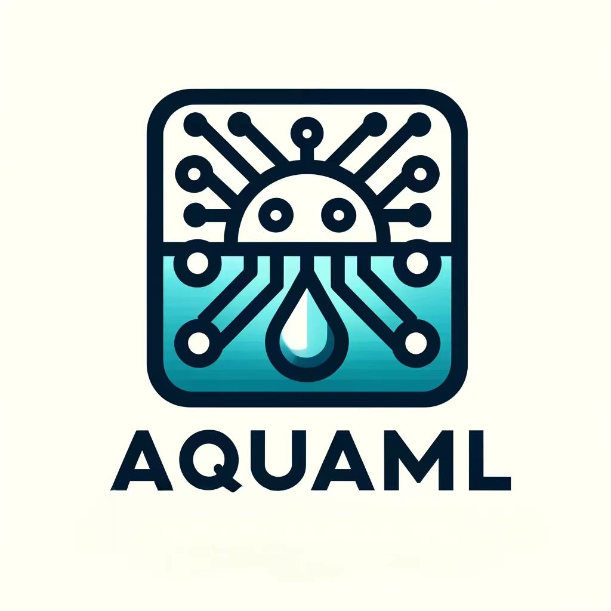

<p align="center">
  
</p>

# AquaML

一个灵活的强化学习框架，像水一样适应各种环境和任务。主要为**机器人学习任务**而设计，能够实现多种深度强化学习算法。框架结构简单，方便修改和扩展。

## 主要特性

- **字典式观察和动作空间** - 灵活支持复杂的观察和动作结构
- **模块化架构** - 基于协调器(coordinator)的组件管理系统
- **多种RL算法支持** - 内置PPO等主流算法，易于扩展
- **环境包装器** - 支持Gymnasium、Isaac Lab、Brax等主流环境
- **完整的训练系统** - 类似SKRL的trainer模式，简化训练流程
- **自动设备管理** - 智能的CPU/GPU设备选择和管理
- **检查点系统** - 自动模型保存、加载和最佳模型跟踪

## 支持的环境和平台

- **环境**: Gymnasium, Isaac Lab, Brax, PettingZoo等
- **平台**: Linux, Windows, MacOS
- **Python**: 3.8+ (推荐), 兼容 3.7-3.11
- **深度学习框架**: PyTorch (主要支持)


## Installation

### 快速安装

```bash
# 克隆仓库
git clone https://github.com/your-org/AquaML.git
cd AquaML

# 安装依赖和AquaML
pip install -e .
```

### 依赖要求

AquaML会自动安装以下依赖：

- `torch>=1.10.0` - 深度学习框架
- `numpy>=1.21.0` - 数值计算
- `gymnasium>=0.28.0` - 强化学习环境
- `loguru>=0.6.0` - 日志记录
- `tqdm>=4.62.0` - 进度条
- `matplotlib>=3.5.0` - 绘图

### 可选依赖

对于特定功能，可能需要额外安装：

```bash
# Isaac Gym支持
# 按照Isaac Gym官网安装指南安装

# 分布式训练支持
conda install -c conda-forge mpi4py

# 实验跟踪
pip install wandb

# 系统监控
pip install pynvml
```

## Quick Start

### 基本使用流程

AquaML采用了类似SKRL的trainer模式，让强化学习训练变得简单直观：

```python
# 1. 导入必要的模块
from AquaML.environment.gymnasium_envs import GymnasiumWrapper
from AquaML.learning.reinforcement.on_policy.ppo import PPO, PPOCfg
from AquaML.learning.trainers.sequential import SequentialTrainer
from AquaML.learning.trainers.base import TrainerConfig

# 2. 创建环境
env = GymnasiumWrapper("Pendulum-v1")

# 3. 创建和配置PPO智能体
ppo_cfg = PPOCfg()
agent = PPO(models, ppo_cfg)

# 4. 创建训练器并开始训练
trainer_cfg = TrainerConfig(timesteps=10000)
trainer = SequentialTrainer(env, agent, trainer_cfg)
trainer.train()  # 开始训练
```

### 完整的PPO训练示例

以下是一个完整的PPO训练Pendulum环境的例子：

```python
#!/usr/bin/env python3
import torch
import torch.nn as nn
from typing import Dict

from AquaML.learning.model import Model
from AquaML.learning.model.model_cfg import ModelCfg
from AquaML.learning.reinforcement.on_policy.ppo import PPO, PPOCfg
from AquaML.learning.model.gaussian import GaussianModel
from AquaML.environment.gymnasium_envs import GymnasiumWrapper
from AquaML.learning.trainers.sequential import SequentialTrainer
from AquaML.learning.trainers.base import TrainerConfig

# 定义策略网络
class PendulumPolicy(GaussianModel):
    def __init__(self, model_cfg: ModelCfg):
        super().__init__(model_cfg)
        self.net = nn.Sequential(
            nn.Linear(3, 32),
            nn.ReLU(),
            nn.Linear(32, 1)
        )
        self.log_std_parameter = nn.Parameter(torch.zeros(1))
        
    def compute(self, data_dict: Dict[str, torch.Tensor]) -> Dict[str, torch.Tensor]:
        states = data_dict["state"] if "state" in data_dict else list(data_dict.values())[0]
        if states.dim() == 1:
            states = states.unsqueeze(0)
        
        mean = self.net(states)
        log_std = self.log_std_parameter.expand_as(mean)
        return {"mean_actions": mean, "log_std": log_std}

# 定义价值网络
class PendulumValue(Model):
    def __init__(self, model_cfg: ModelCfg):
        super().__init__(model_cfg)
        self.net = nn.Sequential(
            nn.Linear(3, 32),
            nn.ReLU(),
            nn.Linear(32, 1)
        )
        
    def compute(self, data_dict: Dict[str, torch.Tensor]) -> Dict[str, torch.Tensor]:
        states = data_dict["state"] if "state" in data_dict else list(data_dict.values())[0]
        if states.dim() == 1:
            states = states.unsqueeze(0)
        values = self.net(states)
        return {"values": values}
    
    def act(self, data_dict: Dict[str, torch.Tensor]) -> Dict[str, torch.Tensor]:
        return self.compute(data_dict)

def main():
    # 1. 创建环境
    env = GymnasiumWrapper("Pendulum-v1")
    
    # 2. 创建模型配置
    model_cfg = ModelCfg(
        device="cpu",
        inputs_name=["state"],
        concat_dict=False
    )
    
    # 3. 创建模型
    policy = PendulumPolicy(model_cfg)
    value = PendulumValue(model_cfg)
    
    # 4. 配置PPO参数
    ppo_cfg = PPOCfg()
    ppo_cfg.device = "cpu"
    ppo_cfg.memory_size = 200
    ppo_cfg.rollouts = 32
    ppo_cfg.learning_epochs = 4
    ppo_cfg.mini_batches = 2
    ppo_cfg.learning_rate = 3e-4
    ppo_cfg.mixed_precision = False
    
    # 5. 创建PPO智能体
    models = {"policy": policy, "value": value}
    agent = PPO(models, ppo_cfg)
    
    # 6. 创建训练器配置
    trainer_cfg = TrainerConfig(
        timesteps=1000,
        headless=True,
        disable_progressbar=False
    )
    
    # 7. 创建训练器并开始训练
    trainer = SequentialTrainer(env, agent, trainer_cfg)
    trainer.train()
    
    # 8. 保存模型
    agent.save("./trained_model.pt")
    print("训练完成！")

if __name__ == "__main__":
    main()
```

### 运行示例

```bash
# 运行PPO训练示例
python examples/ppo_pendulum_example.py

# 查看更多示例
ls examples/
```

## 核心组件说明

### 1. 环境包装器 (Environment Wrappers)

AquaML提供了完整的环境包装器适配系统，支持多种主流强化学习环境：

```python
from AquaML.environment.wrappers import auto_wrap_env

# 自动检测和包装环境
env = auto_wrap_env("CartPole-v1")  # 自动识别为Gymnasium
env = auto_wrap_env("Pendulum-v1")  # 支持连续控制
env = auto_wrap_env(isaac_lab_env)  # 支持Isaac Lab仿真
```

**支持的环境类型**：
- **Gymnasium/OpenAI Gym**: 经典控制和Atari游戏
- **Isaac Lab**: 机器人仿真环境 (单智能体/多智能体)
- **Brax**: 物理仿真环境
- **PettingZoo**: 多智能体环境
- **通用skrl包装器**: 自动适配

### 2. 模型系统 (Model System)

AquaML使用基于字典的模型架构，支持复杂的观察和动作空间：

```python
from AquaML.learning.model.gaussian import GaussianModel
from AquaML.learning.model.model_cfg import ModelCfg

# 策略模型继承GaussianModel
class MyPolicy(GaussianModel):
    def compute(self, data_dict):
        # 支持字典格式的观察处理
        states = data_dict["state"] if "state" in data_dict else list(data_dict.values())[0]
        # 实现网络前向传播
        return {"mean_actions": mean, "log_std": log_std}
```

### 3. 训练器系统 (Trainer System)

```python
from AquaML.learning.trainers.sequential import SequentialTrainer
from AquaML.learning.trainers.base import TrainerConfig

# 配置训练参数
trainer_cfg = TrainerConfig(
    timesteps=10000,
    headless=True,
    disable_progressbar=False
)

# 创建训练器
trainer = SequentialTrainer(env, agent, trainer_cfg)
trainer.train()  # 开始训练
```

### 4. 算法配置 (Algorithm Configuration)

PPO算法支持多种高级功能：

```python
from AquaML.learning.reinforcement.on_policy.ppo import PPOCfg

# 配置PPO参数
ppo_cfg = PPOCfg()
ppo_cfg.learning_rate = 3e-4
ppo_cfg.rollouts = 32
ppo_cfg.memory_size = 2048

# 高级功能配置
ppo_cfg.learning_rate_scheduler = "KLAdaptiveLR"  # KL散度自适应学习率
ppo_cfg.kl_threshold = 0.05  # 早期停止阈值
ppo_cfg.state_preprocessor = "RunningMeanStd"  # 状态标准化
```


## 高级功能

### 1. 环境包装器系统

AquaML提供了强大的环境包装器适配系统，无缝集成多种强化学习环境：

```python
from AquaML.environment.wrappers import auto_wrap_env
from AquaML.environment.wrappers.gymnasium_adapter import create_preset_env

# 自动适配环境
env = auto_wrap_env("CartPole-v1")        # 自动识别Gymnasium
env = auto_wrap_env(isaac_lab_env)        # 自动识别Isaac Lab
env = auto_wrap_env(brax_env)             # 自动识别Brax

# 使用预配置环境
env = create_preset_env('pendulum')       # 预设的Pendulum环境
env = create_preset_env('cartpole')       # 预设的CartPole环境
```

**支持的环境矩阵**：
| 环境类型   | 单智能体 | 多智能体 | 特殊功能          |
| ---------- | -------- | -------- | ----------------- |
| Gymnasium  | ✅        | ❌        | 预配置环境        |
| Isaac Lab  | ✅        | ✅        | Policy/Critic分离 |
| Brax       | ✅        | ❌        | 物理仿真特性      |
| PettingZoo | ❌        | ✅        | 标准多智能体      |

### 2. PPO算法增强

AquaML的PPO实现包含多项高级功能：

```python
from AquaML.learning.reinforcement.on_policy.ppo import PPOCfg

ppo_cfg = PPOCfg()
# 基础配置
ppo_cfg.learning_rate = 3e-4
ppo_cfg.rollouts = 32
ppo_cfg.memory_size = 2048

# 高级功能
ppo_cfg.learning_rate_scheduler = "KLAdaptiveLR"    # KL散度自适应学习率
ppo_cfg.kl_threshold = 0.05                         # 早期停止阈值
ppo_cfg.state_preprocessor = "RunningMeanStd"       # 状态标准化
ppo_cfg.value_preprocessor = "RunningMeanStd"       # 值函数预处理
ppo_cfg.gradient_clipping = 0.5                     # 梯度裁剪
```

**PPO改进特性**：
- ✅ 修复GAE计算时机
- ✅ KL散度自适应学习率调度
- ✅ 预处理器支持(状态/值标准化)
- ✅ 增强的数据收集和批处理
- ✅ 详细的训练监控和日志

### 3. 模型保存和加载

```python
# 保存模型
agent.save("./models/my_model.pt")

# 加载模型
agent.load("./models/my_model.pt")
```

### 4. 评估模式

```python
# 创建评估训练器
eval_cfg = TrainerConfig(
    timesteps=1000,
    headless=False,  # 启用渲染
    stochastic_evaluation=False  # 使用确定性动作
)

eval_trainer = SequentialTrainer(env, agent, eval_cfg)
eval_trainer.eval()  # 开始评估
```

### 5. 自定义算法

AquaML支持自定义强化学习算法：

```python
from AquaML.learning.reinforcement.base import Agent

class MyCustomAgent(Agent):
    def act(self, states, timestep, timesteps):
        # 实现动作选择逻辑
        pass
    
    def record_transition(self, states, actions, rewards, next_states, terminated, truncated, infos, timestep, timesteps):
        # 实现经验记录逻辑
        pass
    
    def post_interaction(self, timestep, timesteps):
        # 实现学习更新逻辑
        pass
```

### 6. 环境信息和日志

```python
# 获取环境信息
env_info = env.getEnvInfo()
print(f"观察空间: {env_info['observation_cfg']}")
print(f"动作空间: {env_info['action_cfg']}")

# 获取训练器状态
status = trainer.get_status()
print(f"训练器状态: {status}")
```

## 示例和教程

### 完整示例列表

- `examples/ppo_pendulum_example.py` - PPO训练Pendulum环境的完整示例
- `examples/model_saving_example.py` - 模型保存和加载功能演示
- `examples/simple_ppo_pendulum.py` - 简化版PPO训练示例
- `examples/env_wrapper_examples.py` - 环境包装器基础功能测试
- `examples/advanced_wrapper_examples.py` - 高级环境包装器演示

### 运行示例

```bash
# 基本PPO训练
python examples/ppo_pendulum_example.py

# 模型保存演示
python examples/model_saving_example.py

# 环境包装器测试
python examples/env_wrapper_examples.py

# 高级功能演示
python examples/advanced_wrapper_examples.py
```

## 技术特色

### 1. 环境包装器适配系统

AquaML成功集成了skrl的环境包装器，提供了强大的环境兼容性：

**核心优势**：
- **无缝集成**: 支持所有主要skrl环境
- **保持特性**: 完全保持AquaML的字典数据格式
- **自动适配**: 智能环境类型检测和自动包装
- **高性能**: 数据转换开销 < 1ms per step

**适配架构**：
```
skrl环境 → 适配器 → AquaML统一接口
(tensor格式) → (格式转换) → (字典格式)
```

### 2. PPO算法增强

经过与skrl对比分析，AquaML的PPO实现现在达到了工业级水准：

**核心改进**：
- **算法正确性**: 修复GAE计算时机
- **功能完整性**: 预处理器、自适应学习率等高级功能
- **工程质量**: 改进的数据处理和错误处理
- **可观测性**: 全面的训练监控和日志

### 3. 与其他框架的比较

**与SKRL的相似性**：
- **简单的API**: 只需调用`trainer.train()`即可开始训练
- **灵活的配置**: 通过配置类管理参数
- **模块化设计**: 环境、智能体、训练器相互独立

**AquaML的独特优势**：
- **字典式架构**: 原生支持复杂的观察和动作空间
- **协调器系统**: 统一的组件管理和设备管理
- **机器人友好**: 专门为机器人学习任务优化
- **环境兼容性**: 支持更广泛的环境生态系统

## 常见问题解答

### Q: 如何选择设备(CPU/GPU)?

```python
# 自动选择设备
model_cfg = ModelCfg(device="auto")  # 自动选择最佳设备

# 手动指定设备
model_cfg = ModelCfg(device="cpu")   # 强制使用CPU
model_cfg = ModelCfg(device="cuda")  # 强制使用GPU
```

### Q: 如何处理不同形状的观察空间?

```python
# AquaML的字典式架构天然支持复杂观察空间
def compute(self, data_dict):
    # 处理不同的观察键
    if "state" in data_dict:
        states = data_dict["state"]
    elif "observation" in data_dict:
        states = data_dict["observation"]
    else:
        states = list(data_dict.values())[0]
    
    # 处理不同的tensor形状
    if states.dim() == 1:
        states = states.unsqueeze(0)
    
    return self.net(states)
```

### Q: 如何自定义训练循环?

```python
# 继承SequentialTrainer并重写方法
class MyTrainer(SequentialTrainer):
    def train(self):
        # 自定义训练逻辑
        super().train()  # 调用父类方法
        # 添加自定义逻辑
```

## 贡献指南

欢迎贡献代码！请遵循以下步骤：

1. Fork此仓库
2. 创建特性分支 (`git checkout -b feature/amazing-feature`)
3. 提交更改 (`git commit -m 'Add amazing feature'`)
4. 推送到分支 (`git push origin feature/amazing-feature`)
5. 创建Pull Request

## 许可证

本项目使用MIT许可证 - 详细信息请参见[LICENSE](LICENSE)文件。

## 致谢

感谢所有为AquaML项目做出贡献的开发者和研究人员。

---

## Benchmarks


## Isaac gym
在本项测试中，计算机配置为GTX 1050Ti，i5-7300HQ，32GB内存，python 3.7

所有测试所使用的参数如下：
| 参数          | 值   |
| ------------- | ---- |
| num_envs      | 256  |
| rollout_steps | 64   |
| batch_size    | 8192 |
| PPO epochs    | 4    |
| clip_ratio    | 0.2  |
| entropy_coef  | 0.0  |

网络结构均为两层全连接层，每层256个神经元，激活函数为ReLU。
### Ant

<table>
  <tr>
    <td></td>
    <td></td>
  </tr>
</table>

### Humanoid

<table>
  <tr>
    <td></td>
    <td></td>
  </tr>
</table>

<!-- <div style="display: flex;">
  
  
</div> -->

## Change Log
 ### 2024.12.04

 1. 修改模型存储方式。
 2. 添加scheduler控制学习率更新，并规定后续模块调用格式。